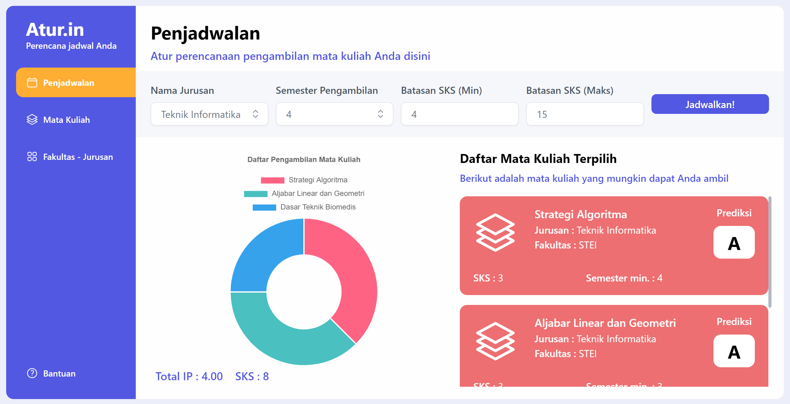
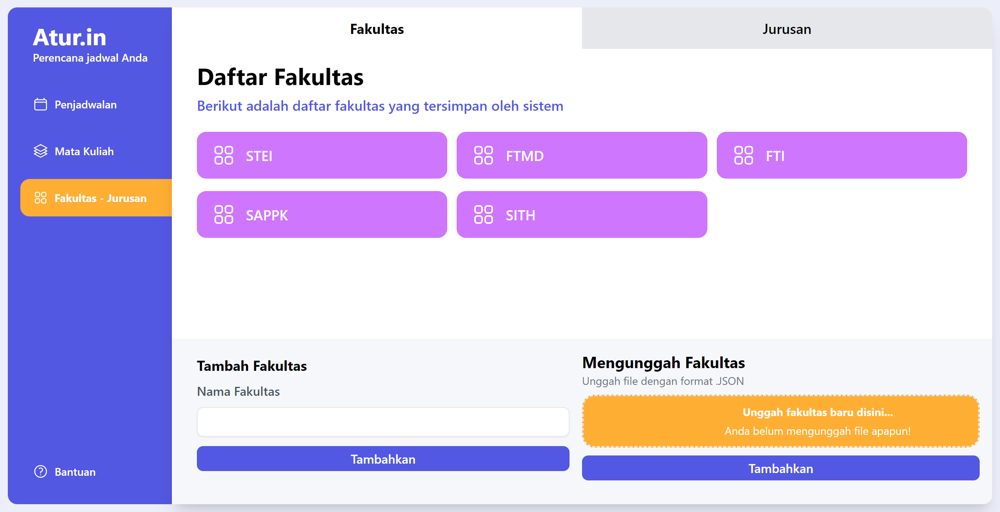
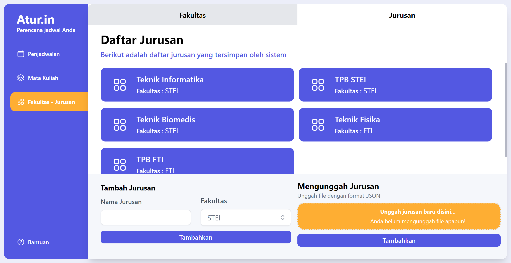
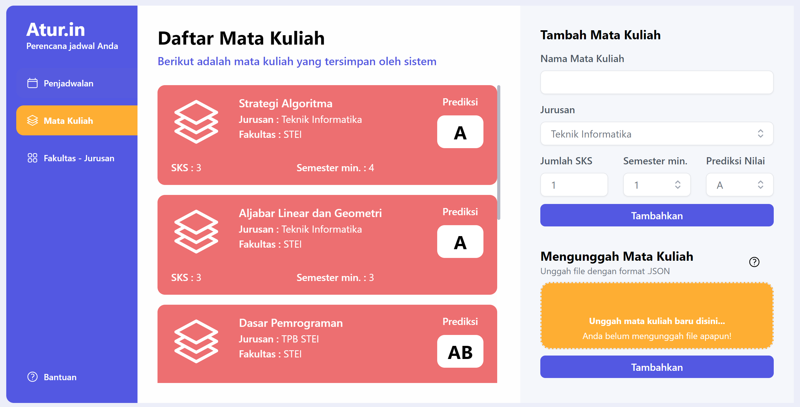

# 📅 Atur.in - Course Scheduler
> Frontend side of Course Scheduler using Dynamic Programming with React Typescript and Golang

## General Information
Atur.in is a simple course scheduler to plan what course to take based on user prediction. The program will proceed an input from forms to setup what the configuration on filtering process then receive the best plan on what course to take using popular effective algorithm, dynamic programming. User can also add more Fakultas, Jurusan, and Mata Kuliah by filling the forms or upload a .json file for batch. The program also provide a good chart illustration on mata kuliah composition based on the course recommendation. Furthermore, the project information is also provided for future improvements.

## Project Structure
```bash
.
├─── img
├─── src
│   ├─── assets
│   │   ├─── icon
│   │   └─── images
│   ├─── components
│   │   ├─── Cards
│   │   ├─── Chart
│   │   ├─── Dropdown
│   │   ├─── Forms
│   │   ├─── Sidebar
│   │   └─── Splashscreen
│   ├─── pages
│   │   ├─── Control
│   │   ├─── Matkul
│   │   └─── Schedule
│   ├─── App.css
│   ├─── App.tsx
│   ├─── index.css
│   ├─── main.tsx
│   └─── vite-env.d.ts
├─── test
├─── .env.example
├─── .eslintrc.json
├─── .gitignore
├─── docker-compose.yml
├─── Dockerfile
├─── index.html
├─── package-lock.json
├─── package.json
├─── postcss.config.js
├─── README.md
├─── tailwind.config.js
├─── tsconfig.json
├─── tsconfig.node.json
└─── vite.config.ts
```

## Prerequisites
- node.js (v 18.12.1)
- npm (v 8.19.2)
- React (v 18.2.0)
- Tailwind (v 3.3.2) for styling
- react-chartjs-2 (v 5.2.0) for chart illustration
- react-toastify (v 9.1.3) for modals on error and success
- Docker

## Algorithms
Algorithm implemented on backend side. Further explanation and implementation of Dynamic Programming Algorithm stated on [this repository](https://github.com/mikeleo03/Course-Scheduler_Backend)

## How to Compile and Run the Program
Before running the service, make sure you have docker installed. Click [this link](https://docs.docker.com/get-docker/) for installation.<br />
Clone this repository from terminal with this command
``` bash
$ git clone https://github.com/mikeleo03/Course-Scheduler_Frontend.git
```
### Run the application on development server
Compile the program by running the following *command*
``` bash
$ docker-compose up -d
```
If you do it correctly, the pogram should be running on localhost:3000. Don't forget to run the backend side also. Further explanation on how to run the backend development server stated on [this repository](https://github.com/mikeleo03/Course-Scheduler_Backend)

### Run the application after doing updates
To run the program after doing updates, you can add a build tag by using this *command*
``` bash
$ docker-compose up -d --build
```
## How to Use the Program
1. Go to the website with the procedure explained before.
2. Fill the forms to set the considered initial configuration on what to search then the program will show the course recommendtaion. The program also will give error messages if the input file is not well-formatted. If the input is valid, there must be list of course recommendation accompanied with pie chart illustration.
3. Explore the whole feature! You can add new Fakultas, Jurusan, and Mata Kuliah to get a better and better recommendation systems. The program also will give error messages if the input file is not well-formatted.
Get to know more about the website interface by looking at the screenshots down below.

## Available Scripts
In the project directory, you can run:

### `npm install`
### `npm run dev`

Ths runs the app in the development mode.

The page will reload if you make edits.<br />
You will also see any lint errors in the console. You can also use the environment by appyling the basic .env configuration on .env.example file.

## Screenshots





## References
- https://tailwindcss.com/
- https://www.typescriptlang.org/id/docs/handbook/react.html
- https://www.docker.com/

## Contributors
<a href = "https://github.com/mikeleo03/markdown-editor/graphs/contributors">
  
</a>